# Przepisowo
***
Aplikacja webowa stworzona na potrzeby kursu "Wstęp do projektowania aplikacji internetowych"

## Opis
***
Przepisowo to aplikacja umożliwiające użytkownikom przeglądanie przepisów kulinarnych.
Użytkownicy mogą wyszukiwać konkretne przepisy, komentować je oraz dodawać własne przepisy kulinarne.

## Użyte technologie

***
Technologie użyte w projekcie:
* HTML
* CSS
* PostgreSQL
* PHP
* JavaScript

## Zrzuty ekranu aplikacji

#### Rejestracja
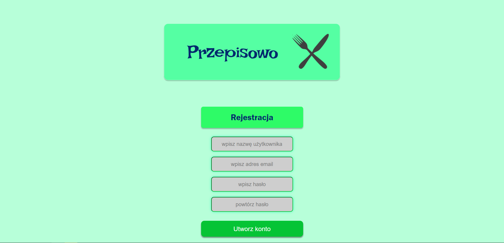

#### Logowanie
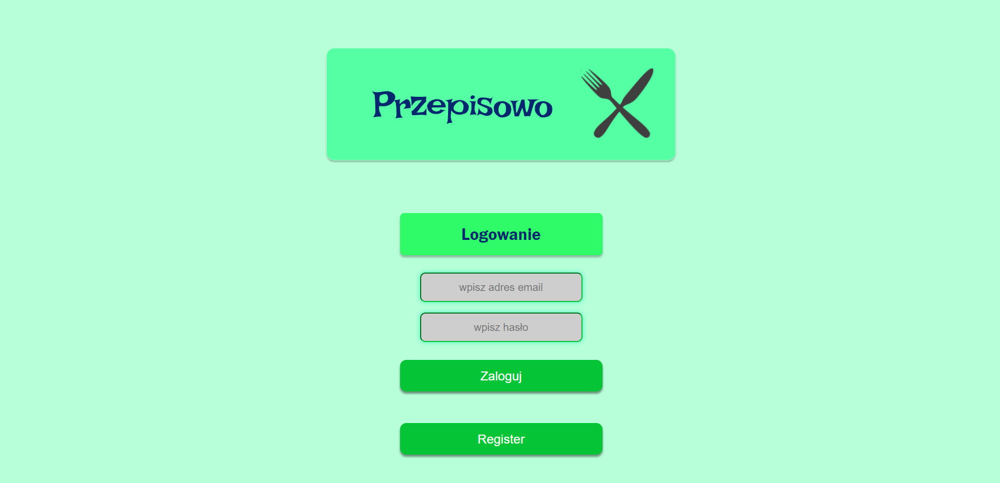

#### Strona główna
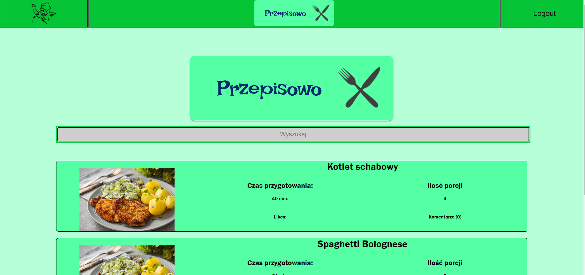
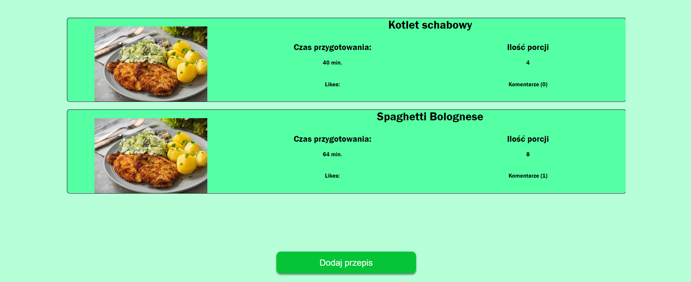

#### Szczegóły przepisu
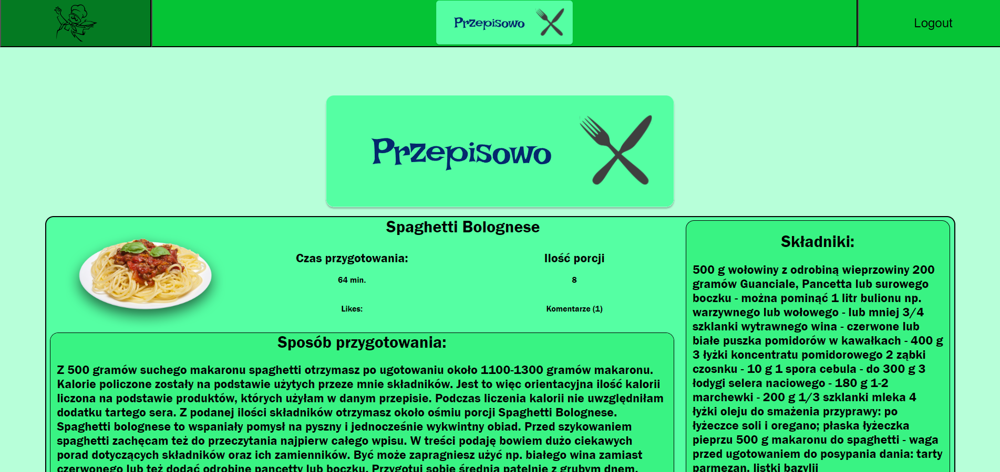
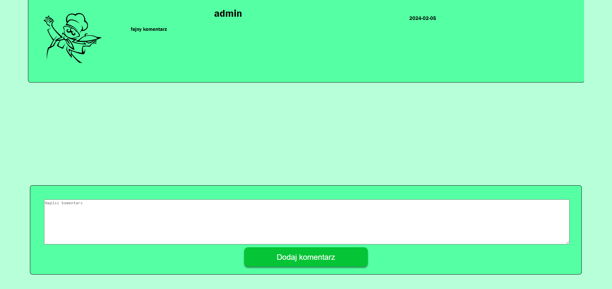

#### Wyszukiwanie przepisu
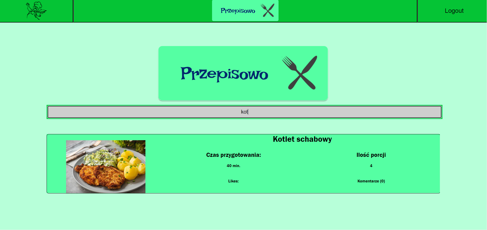

#### Profil użytkownika
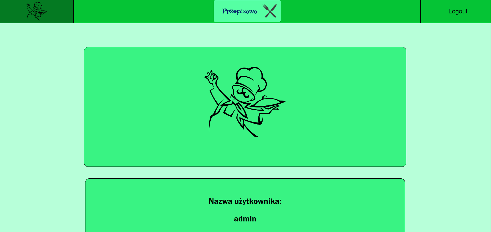
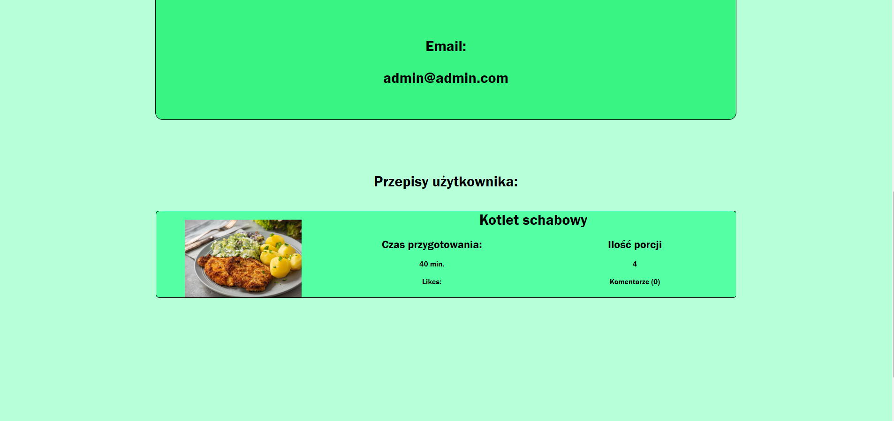

#### Menu dodawania przepisów
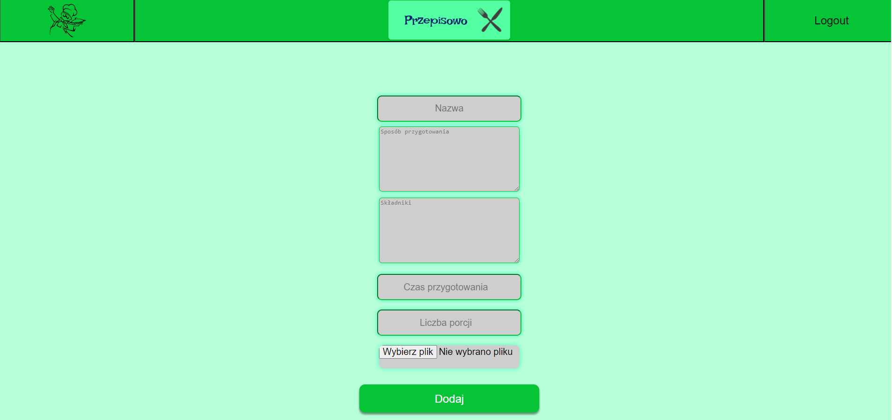

## Schemat ERD bazy danych
***
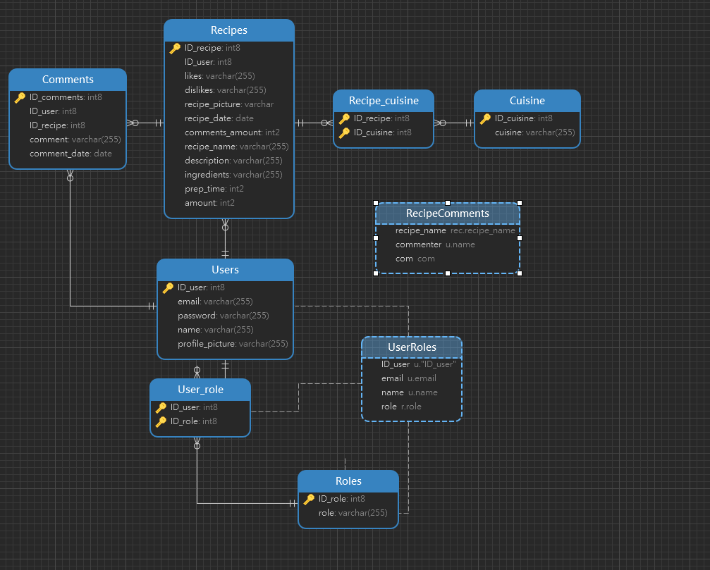

## Zarządca

Adam Prokop  [github](https://github.com/AdamProk)